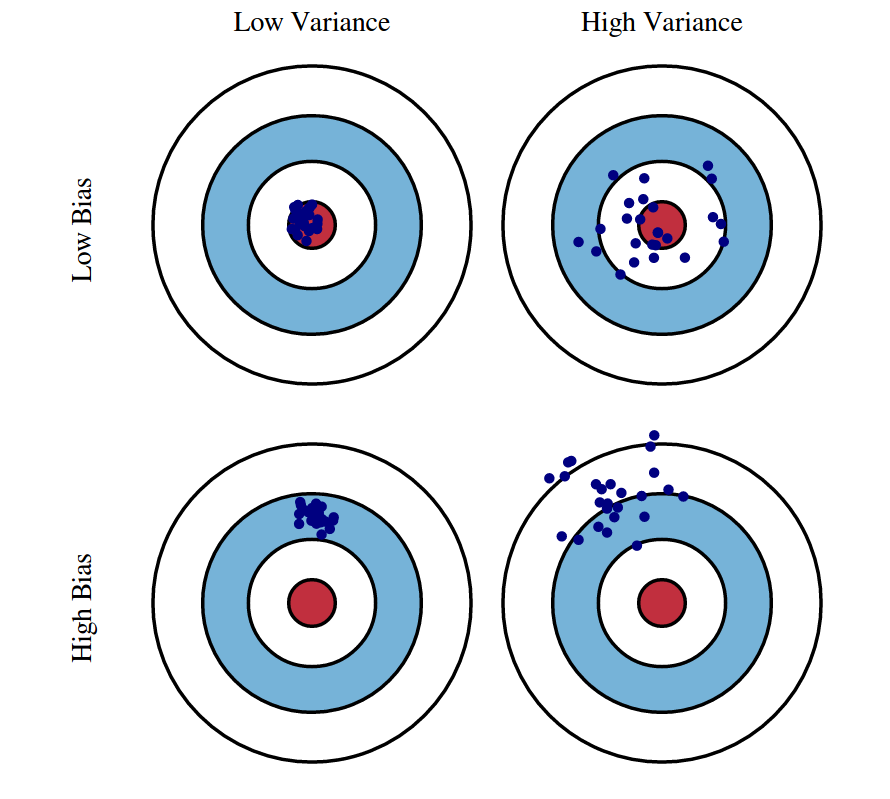
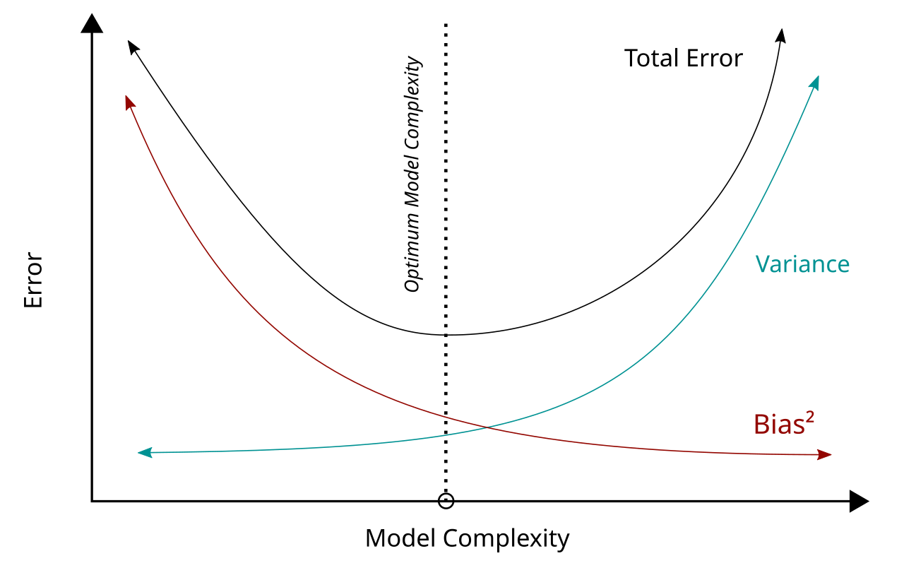
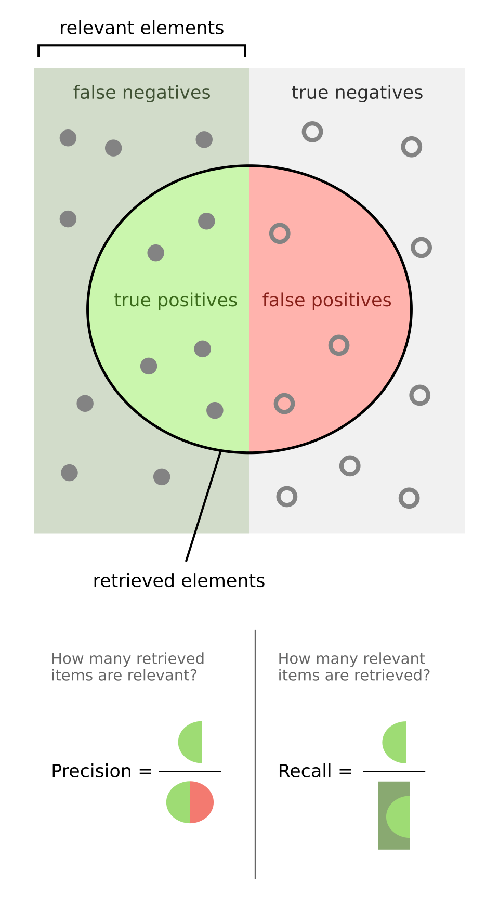
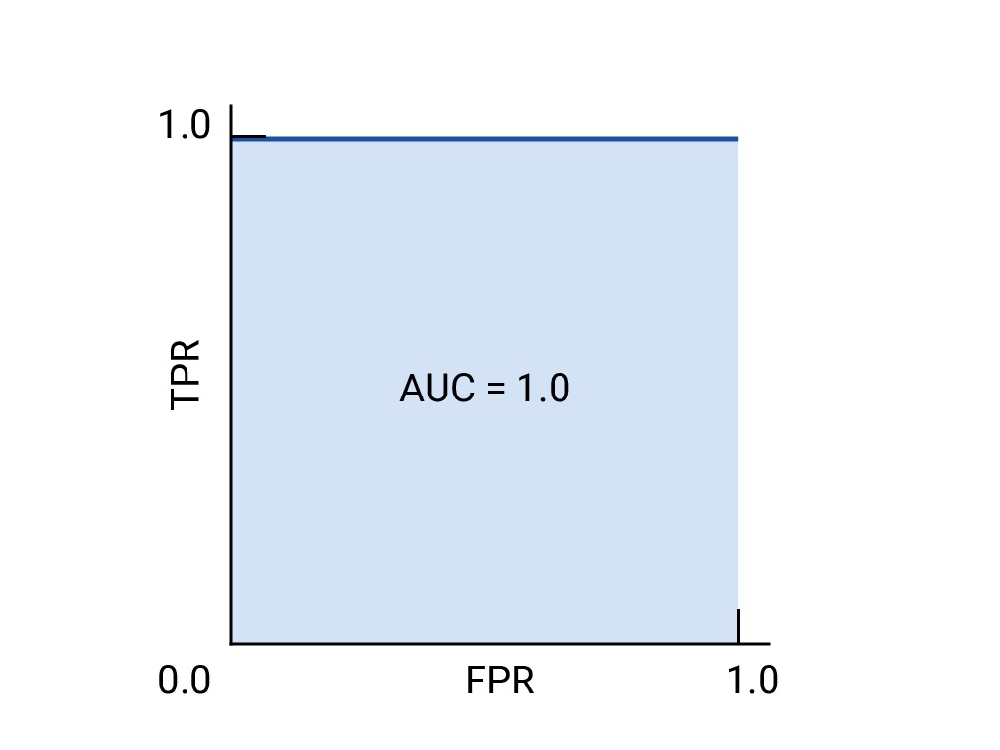

# Fundamentos de Machine Learning

## Objetivos de Aprendizaje

Al finalizar este capítulo, serás capaz de:

- Comprender la transición de sistemas basados en reglas a modelos de aprendizaje inductivo
- Aplicar la definición formal de Machine Learning a problemas de negocios
- Identificar problemas de aprendizaje supervisado y no supervisado
- Reconocer y gestionar el trade-off sesgo-varianza en modelos predictivos
- Comprender los fundamentos matemáticos de Regresión Lineal, Regresión Logística y K-Means
- Traducir métricas técnicas en valor de negocio medible

---

## Introducción: El Cambio de Paradigma en la Toma de Decisiones

En el capítulo anterior exploramos cómo la Minería de Datos, el Machine Learning y la Inteligencia Artificial se relacionan dentro del ecosistema de datos. Establecimos que **el Machine Learning es el motor técnico** que permite extraer valor de los datos.

Ahora profundizaremos en los fundamentos teóricos y prácticos del Machine Learning, desmitificando el concepto de "caja negra" para comprenderlo como un conjunto de herramientas matemáticas de **aproximación de funciones**. Este capítulo sienta las bases técnicas que posteriormente aplicaremos dentro del marco CRISP-DM.

### La Pregunta Fundamental

¿Cómo puede una organización transformar datos históricos ("experiencia") en decisiones futuras más inteligentes? ¿Cómo convertimos la incertidumbre del mercado en riesgo calculable?

La respuesta está en comprender tres elementos fundamentales:

1. **¿Qué hace realmente el Machine Learning?** (Aproximación de funciones)
2. **¿Qué tipos de problemas puede resolver?** (Paradigmas de aprendizaje)
3. **¿Cómo evaluamos si un modelo es útil?** (Sesgo vs. Varianza)

---

## De la Programación Explícita al Aprendizaje Inductivo

### La Limitación de los Sistemas Basados en Reglas

Tradicionalmente, la automatización de procesos de negocio se ha basado en la **programación deductiva**. En este paradigma, el ingeniero actúa como el "arquitecto" de la lógica: debe comprender explícitamente cada variable y cada contingencia, y luego codificar reglas precisas para manejarlas.

**Ejemplo: Aprobación de Crédito Bancario (Década de 1990)**

Un sistema experto tradicional operaría bajo reglas estrictas:

```
SI ingresos > $50,000 Y antigüedad_laboral > 2 años
ENTONCES aprobar_crédito
SINO rechazar_crédito
```

Este enfoque, aunque transparente, es **extremadamente frágil**:

- ¿Qué sucede con un solicitante que gana $49,000 pero tiene 10 años de antigüedad y cero deudas?
- ¿Cómo manejamos 50 variables adicionales como historial crediticio, comportamiento de compra, y estabilidad residencial?
- ¿Cómo adaptamos las reglas cuando cambia la economía?

A medida que el entorno de negocios se vuelve más complejo —con miles de variables como comportamiento web, geolocalización e historial transaccional— la cantidad de reglas necesarias para capturar la realidad **explota exponencialmente**, volviéndose inmanejable para la mente humana.

### La Definición Formal de Machine Learning

El Machine Learning **invierte** este proceso. En lugar de suministrar las reglas a la computadora, suministramos:

- **Los datos** (entradas)
- **Las respuestas deseadas** (salidas históricas)

Y dejamos que la computadora **descubra** las reglas por sí misma.

#### Definición de aprendizaje de máquina

> "Se dice que un programa de computadora aprende de la experiencia $E$ con respecto a alguna clase de tareas $T$ y medida de rendimiento $P$, si su desempeño en las tareas en $T$, medido por $P$, mejora con la experiencia $E$."

Para el ingeniero de negocios, descomponer esta definición es vital para **identificar oportunidades de ML** en la empresa:

| Componente | Definición | Ejemplo: Detección de Fraude | Ejemplo: Valoración Inmobiliaria |
|------------|------------|------------------------------|----------------------------------|
| **Tarea ($T$)** | Labor que el sistema debe ejecutar| Clasificar una transacción como "Fraudulenta" o "Legítima" | Predecir el precio de venta de una propiedad |
| **Experiencia ($E$)** | Los datos históricos que el sistema utiliza para entrenarse | Millones de transacciones pasadas con sus etiquetas reales | Historial de ventas de casas con características y ubicación |
| **Rendimiento ($P$)** | La métrica cuantitativa que define el éxito | Precisión, Recall, o Costo Financiero del Fraude | Error Cuadrático Medio (diferencia precio predicho vs. real) |

#### Implicación Estratégica

La definición revela algo poderoso: **el Machine Learning es un activo que se aprecia con el uso**. A diferencia del software tradicional que se deprecia si no se actualiza, un sistema de ML teóricamente se vuelve más inteligente y valioso a medida que la organización acumula más experiencia ($E$).

### La Analogía del Jardinero vs. el Arquitecto

Una metáfora poderosa para entender este cambio de rol:

| Arquitecto (Programación Tradicional) | Jardinero (Machine Learning) |
|---------------------------------------|------------------------------|
| Diseña cada detalle desde arriba hacia abajo | Prepara el entorno adecuado |
| Si la estructura falla, es error de diseño | Nutre el suelo (datos limpios) |
| Control absoluto, adaptabilidad baja | La planta crece por procesos intrínsecos |
| El éxito depende de prever cada contingencia | El éxito depende de cultivar el ecosistema |

Como ingenieros de negocios, nuestro objetivo es convertirnos en **"Jardineros de Datos"** competentes, capaces de cultivar modelos que resuelvan problemas complejos dentro del marco CRISP-DM.

---

## Fundamentos Teóricos: La Aproximación de Funciones

### La Hipótesis de la Función Universal

Suponemos que existe una función $f$ :

$$y = f(x)$$

Donde:

- $x$ es el vector de variables de entrada (precio, día de la semana, clima, competidores)
- $y$ es la variable objetivo que queremos predecir (demanda, ventas, probabilidad de compra)

Si conociéramos $f(x)$ a la perfección, no necesitaríamos Machine Learning; simplemente usaríamos la fórmula para tomar decisiones perfectas.

Sin embargo, en la realidad:

1. **$f(x)$ es incognoscible**: Es infinitamente compleja, dinámica y a menudo oculta en la psicología humana o las interacciones caóticas del mercado
2. **El mundo es ruidoso**: Existen factores aleatorios imposibles de medir

Por lo tanto, la realidad se expresa como:

$$y = f(x) + \epsilon$$

Donde:

- $\epsilon$ (épsilon) sulee representar el **error irreducible** o ruido aleatorio. Sin embargo, también puede representar el efecto de variables que no hemos medido.

### El Objetivo: Encontrar la Función Estimada

El objetivo del Machine Learning es utilizar datos históricos para construir una **función estimada**, denotada como $\hat{f}(x)$, que imite a $f(x)$ lo suficientemente bien como para ser útil:

$$y \approx \hat{f}(x)$$

Este proceso es análogo a la **Ingeniería Inversa**: observamos las entradas y salidas de la "caja negra" de la realidad y tratamos de construir una "caja blanca" matemática que produzca las mismas salidas ante las mismas entradas.

### Generalización vs. Memorización

La distinción clave es que no queremos simplemente **"memorizar"** los puntos de datos pasados. Queremos aprender la **estructura subyacente** de $f(x)$ para poder predecir $y$ para nuevos valores de $x$ que nunca hemos visto antes.

Esta capacidad de aplicar lo aprendido a escenarios futuros no vistos se llama **Generalización**.

**Analogía Educativa:**

- **Memorización**: Un estudiante memoriza las respuestas de un examen de práctica → Obtiene 100% en la práctica pero falla en el examen real
- **Generalización**: El estudiante aprende los *principios* subyacentes → Obtiene 90% en la práctica y mantiene ese 90% en el examen real

El ML busca aprender los principios, no memorizar los datos.

---

## Paradigmas de Aprendizaje: Supervisado y No Supervisado

Dependiendo de la naturaleza de la "Experiencia" ($E$) disponible, los algoritmos de ML se dividen en paradigmas distintos.

### Aprendizaje Supervisado: Aprendiendo con un Maestro

El aprendizaje supervisado es el paradigma dominante en las aplicaciones de negocios actuales. Se caracteriza por el uso de **Datos Etiquetados**.

#### El Proceso

Imagina un estudiante (el algoritmo) y un maestro (los datos históricos):

1. El maestro muestra al estudiante una serie de ejemplos (inputs $x$) junto con las respuestas correctas (targets $y$)
2. El estudiante hace una predicción
3. El maestro la corrige
4. El estudiante ajusta su comprensión interna para reducir el error en el futuro

#### La Meta

Aprender el mapeo $x \rightarrow y$ para poder predecir $y$ cuando solo veamos $x$ en el futuro.

#### Subtipos Principales

**1. Regresión:** La variable de salida $y$ es **numérica/continua**

- *Ejemplos*: Predecir ventas del próximo mes, estimar tiempo de vida de maquinaria, calcular precio óptimo de seguro
- *Pregunta*: "¿Cuánto?" o "¿Cuántos?"

**2. Clasificación:** La variable de salida $y$ es **categórica/discreta**

- *Ejemplos*: ¿El cliente comprará? (Sí/No), ¿Es esta imagen un perro o un gato?, ¿Es esta transacción fraude?
- *Pregunta*: "¿Cuál?" o "¿Qué tipo?"

#### Ejemplo de Negocio: Predicción de Churn

Una empresa de telecomunicaciones quiere predecir la fuga de clientes (Churn):

- **Datos históricos**: 5 años de perfiles de clientes con columna "Canceló Servicio: Sí/No"
- **Entrenamiento**: El modelo aprende patrones de clientes que cancelaron vs. los que se quedaron
- **Aplicación**: Se aplica a clientes actuales para identificar quiénes están en riesgo de irse *antes de que suceda*
- **Valor**: Permite intervención proactiva con campañas de retención dirigidas

### Aprendizaje No Supervisado: Descubrimiento de Patrones

El aprendizaje no supervisado opera en un entorno de mayor incertidumbre. No hay maestro ni respuestas correctas. Los datos consisten únicamente en entradas ($x$), sin ninguna etiqueta de salida ($y$).

#### El Proceso

El algoritmo explora los datos sin guía externa, buscando estructuras inherentes, similitudes o anomalías. Es comparable a un niño que organiza sus juguetes por forma o color sin que nadie le haya enseñado los nombres de las categorías.

#### La Meta

Descubrir información oculta ("insights") sobre la estructura de los datos que la empresa desconocía.

#### Aplicaciones Principales en Negocios

**1. Clusterización (Clustering):** Agrupar instancias similares

- *Ejemplo*: Segmentación de clientes. El algoritmo descubre que existen tres tipos de compradores: "Cazadores de ofertas", "Compradores impulsivos de fin de semana" y "Clientes corporativos", basándose solo en patrones de compra

**2. Detección de Anomalías:** Identificar eventos que se desvían significativamente de la norma

- *Ejemplo*: Seguridad informática. El sistema no sabe qué es un "ataque", pero detecta que *este* comportamiento específico es extremadamente raro comparado con el tráfico normal

**3. Reducción de Dimensionalidad:** Simplificar datos complejos con muchas variables a un número menor de variables representativas

### Tabla Comparativa

| Característica | Aprendizaje Supervisado | Aprendizaje No Supervisado |
|----------------|-------------------------|----------------------------|
| **Datos de Entrada** | Datos Etiquetados ($x, y$) | Datos No Etiquetados ($x$) |
| **Objetivo** | Predicción (Predecir $y$) | Descripción (Entender estructura de $x$) |
| **Feedback** | Directo (Error entre predicción y real) | Inexistente (Basado en coherencia interna) |
| **Complejidad de Evaluación** | Más fácil de evaluar (¿Acertó?) | Difícil de evaluar objetivamente |
| **Ejemplo Típico** | Predecir precio de acciones | Segmentar clientes por comportamiento |
| **Fase CRISP-DM típica** | Modelado con objetivo claro | Entendimiento de Datos / Exploración |

---

## El Dilema Estratégico: Sesgo vs. Varianza

Antes de implementar cualquier modelo en CRISP-DM, el ingeniero de negocios debe comprender el compromiso fundamental que gobierna la calidad de todos los modelos de ML: el **Trade-off Sesgo-Varianza**.

Este concepto conecta la teoría matemática con la estrategia de gestión de riesgos.

### La Descomposición del Error

El error total de cualquier modelo predictivo se puede descomponer en tres partes:

$$\text{Error Total} = \text{Sesgo}^2 + \text{Varianza} + \text{Error Irreducible } (\epsilon)$$

### El Sesgo (Bias): El Error de la Simplificación

El sesgo ocurre cuando el modelo hace **suposiciones demasiado simplistas** sobre la función subyacente $f(x)$ para facilitar el aprendizaje.

**Concepto:** Un modelo con alto sesgo es "cerrado de mente". Ignora la complejidad de los datos y fuerza una solución simple.

- *Síntoma (Underfitting/Subajuste)*: El modelo tiene un rendimiento pobre tanto en datos de entrenamiento como en datos de prueba. No ha aprendido la relación real

### La Varianza (Variance): El Error de la Complejidad

La varianza es la sensibilidad del modelo a las **fluctuaciones aleatorias** (ruido) en los datos de entrenamiento.

**Concepto:** Un modelo con alta varianza es "impresionable". Presta tanta atención a los detalles de los datos históricos que termina memorizando el ruido ($\epsilon$) en lugar de la señal ($f(x)$).

- *Síntoma (Overfitting/Sobreajuste)*: El modelo tiene un rendimiento espectacular en datos de entrenamiento (quizás 99% de precisión) pero falla miserablemente en datos nuevos. No generaliza; solo recuerda

#### Ejemplo gráfico:



### El Trade-off Sesgo-Varianza

En el aprendizaje automático, existe una tensión inevitable:

- **Modelo más complejo** → Reduce sesgo (se ajusta mejor) pero aumenta varianza (más inestable)
- **Modelo más simple** → Reduce varianza (más estable) pero aumenta sesgo (demasiado simple)

El objetivo es encontrar el punto óptimo donde la suma del sesgo y la varianza es mínima.



Esto se logra mediante técnicas como:

- **Validación Cruzada**: Evaluar el modelo en múltiples particiones de datos
- **Regularización**: Penalizar la complejidad innecesaria
- **Early Stopping**: Detener el entrenamiento antes del sobreajuste

---

## Regresión Lineal: La Herramienta de Predicción Continua

La **Regresión Lineal** es el "caballo de batalla" de la analítica de negocios. Aunque existen algoritmos más modernos y complejos, la regresión lineal sigue siendo omnipresente debido a su **simplicidad, velocidad y, sobre todo, interpretabilidad**.

### El Problema de Negocio

Se utiliza cuando la variable objetivo ($y$) es un **número continuo**:

- Proyección de ventas trimestrales ($)
- Estimación de la elasticidad-precio de la demanda
- Predicción del tiempo de entrega de un proveedor (días)
- Valoración de propiedades inmobiliarias

### Intuición Geométrica

Imagina un gráfico de dispersión donde:

- **Eje X**: Gasto en Marketing
- **Eje Y**: Ingresos

Los puntos están dispersos pero muestran una tendencia ascendente. La regresión lineal intenta dibujar la **línea recta** que pasa "más cerca" de todos los puntos simultáneamente.

### La Ecuación del Modelo

$$y = \beta_0 + \beta_1 x_1 + \beta_2 x_2 + ... + \beta_n x_n + \epsilon$$

Donde:

- $\beta_0$ (Intercepto): Valor esperado de $y$ cuando todas las $x$ son cero (e.g., ventas base sin marketing)
- $\beta_i$ (Coeficientes): Representan el peso o importancia de cada variable
- $\epsilon$: Error residual

### El Método de Mínimos Cuadrados (OLS)

¿Cómo decide la máquina cuál es la "mejor" línea?

Utiliza una función de costo llamada **Suma de los Errores Cuadrados** (SSE):

1. Mide la distancia vertical (residuo) entre cada punto real y la línea propuesta
2. Eleva estas distancias al cuadrado (para penalizar mucho más los errores grandes y eliminar signos negativos)
3. Las suma todas

$$\text{Minimizar: } \sum_{i=1}^{n} (y_{\text{real}}^{(i)} - y_{\text{predicho}}^{(i)})^2$$

La línea que produce la suma más baja posible es la solución óptima.

### Interpretación de Negocios: Caja Blanca

A diferencia de las redes neuronales ("Caja Negra"), la regresión lineal es una **"Caja Blanca"**: nos dice el *por qué*.

**Ejemplo:**

Si nuestro modelo de ventas arroja un coeficiente $\beta_{\text{marketing}} = 0.75$, esto tiene una traducción directa a la estrategia:

> *"Ceteris paribus (manteniendo todo lo demás constante), por cada $1,000 adicionales invertidos en marketing, esperamos un incremento de $750 en ventas."*

Esto permite al ingeniero de negocios realizar análisis de **Retorno de Inversión (ROI)**:

- Si el costo del marketing es menor que el retorno marginal ($750 > costo), la decisión lógica es invertir más
- Si el coeficiente es negativo, la actividad está destruyendo valor

### Métricas de Evaluación

Para conectar con la fase de **Evaluación** de CRISP-DM:

**1. $R^2$ (Coeficiente de Determinación)**

- Indica qué porcentaje de la variabilidad de los datos es explicado por el modelo
- $R^2 = 0.85$ significa que nuestro modelo captura el 85% de lo que ocurre en el mercado, dejando 15% a la incertidumbre

**2. RMSE (Raíz del Error Cuadrático Medio)**

- Nos dice el error promedio en las unidades de la variable objetivo
- Ejemplo: "Nuestro modelo se equivoca, en promedio, por ±$500"

**3. MAE (Error Absoluto Medio)**

- Promedio de los errores absolutos
- Más robusto a valores atípicos que RMSE

### Limitaciones (y no tantas limitaciones)

- **Asume linealidad**: Si la relación es no lineal, el modelo será inadecuado. ¿Sobre qué asume la linealidad?
- **Sensible a outliers**: Un solo valor extremo puede distorsionar toda la línea. ¿Qué es lo que hace que esta sensibilidad sea tan alta?
- **Multicolinealidad**: Si las variables independientes están altamente correlacionadas, los coeficientes se vuelven inestables

### Regularización: Ridge y Lasso

Las técnicas de **regularización** son herramientas fundamentales para combatir el **sobreajuste (overfitting)** en regresión lineal, conectándose directamente con el trade-off sesgo-varianza discutido anteriormente.

#### El Problema: Overfitting en Regresión Lineal

Cuando tenemos muchas variables predictoras (alta dimensionalidad) o multicolinealidad, el método de Mínimos Cuadrados Ordinarios (OLS) puede producir modelos que:

- Se ajustan perfectamente a los datos de entrenamiento
- Tienen coeficientes $\beta$ extremadamente grandes y erráticos
- Generalizan muy mal a nuevos datos (alta varianza)

La regularización resuelve esto penalizando la complejidad del modelo.

#### Regresión Ridge (L2)

**La Ecuación:**

Ridge modifica la función de costo agregando un término de penalización proporcional al **cuadrado** de los coeficientes:

$$\text{Minimizar: } \sum_{i=1}^{n} (y_{\text{real}}^{(i)} - y_{\text{predicho}}^{(i)})^2 + \lambda \sum_{j=1}^{p} \beta_j^2$$

Donde:

- El primer término es el **error estándar** (SSE) que ya conocíamos
- El segundo término $\lambda \sum_{j=1}^{p} \beta_j^2$ es la **penalización L2**
- $\lambda$ (lambda) es el **parámetro de regularización** que controla la intensidad de la penalización
  - $\lambda = 0$ → Regresión lineal estándar (sin penalización)
  - $\lambda$ muy grande → Fuerza todos los coeficientes hacia cero

**Utilidad de Ridge:**

1. **Reduce Varianza**: Al penalizar coeficientes grandes, el modelo se vuelve más estable y generaliza mejor
2. **Maneja Multicolinealidad**: Cuando las variables están correlacionadas, Ridge distribuye el peso entre ellas en lugar de asignar valores erráticos
3. **Conserva Todas las Variables**: Ridge reduce los coeficientes pero **nunca los lleva exactamente a cero**. Todas las variables permanecen en el modelo
4. **Ajusta el Trade-off Sesgo-Varianza**: Al aumentar $\lambda$, aumentamos el sesgo ligeramente pero reducimos drásticamente la varianza

**Interpretación de Negocio:**

Ridge es ideal cuando creemos que **todas las variables tienen algún efecto**, aunque sea pequeño, y queremos un modelo más robusto a cambio de un poco más de sesgo.

#### Regresión Lasso (L1)

**La Ecuación:**

Lasso utiliza una penalización proporcional al **valor absoluto** de los coeficientes:

$$\text{Minimizar: } \sum_{i=1}^{n} (y_{\text{real}}^{(i)} - y_{\text{predicho}}^{(i)})^2 + \lambda \sum_{j=1}^{p} |\beta_j|$$

La única diferencia con Ridge es que usa $|\beta_j|$ (penalización L1) en lugar de $\beta_j^2$ (penalización L2).

**Utilidad de Lasso:**

1. **Selección Automática de Variables**: Lasso puede forzar coeficientes **exactamente a cero**, eliminando variables irrelevantes del modelo
2. **Interpretabilidad**: Al producir modelos más simples (con menos variables), facilita la explicación a stakeholders de negocio
3. **Reduce Varianza**: Similar a Ridge, estabiliza el modelo frente al sobreajuste
4. **Feature Engineering Automático**: Actúa como un filtro, identificando las variables más importantes

**Interpretación de Negocio:**

Lasso es preferible cuando sospechamos que **solo un subconjunto de variables es realmente relevante** y queremos que el algoritmo identifique cuáles son, produciendo un modelo más simple y explicable.

#### Comparación Ridge vs. Lasso

| Característica | Ridge (L2) | Lasso (L1) |
|----------------|-----------|-----------|
| **Penalización** | $\lambda \sum \beta_j^2$ | $\lambda \sum \|\beta_j\|$ |
| **Selección de Variables** | No (reduce pero no elimina) | Sí (puede forzar a cero) |
| **Interpretabilidad** | Media (todas las variables) | Alta (modelo más simple) |
| **Multicolinealidad** | Maneja muy bien | Selecciona arbitrariamente una |
| **Uso Típico** | Todas las variables importan | Identificar variables clave |
| **Conexión Sesgo-Varianza** | Aumenta sesgo, reduce varianza | Aumenta sesgo, reduce varianza |

#### Elastic Net: Lo Mejor de Ambos Mundos

En la práctica, existe una técnica que combina ambas penalizaciones:

$$\text{Minimizar: } \text{SSE} + \lambda_1 \sum |\beta_j| + \lambda_2 \sum \beta_j^2$$

Elastic Net es útil cuando tenemos muchas variables correlacionadas y queremos tanto selección como estabilidad.

#### Selección del Parámetro $\lambda$

El valor óptimo de $\lambda$ se determina mediante **Validación Cruzada** (la técnica mencionada en el trade-off sesgo-varianza):

1. Probamos múltiples valores de $\lambda$ (e.g., 0.001, 0.01, 0.1, 1, 10, 100)
2. Para cada valor, evaluamos el error en datos de validación
3. Seleccionamos el $\lambda$ que minimiza el error de generalización
---

## Regresión Logística: Clasificación y Probabilidad

A menudo, el ingeniero de negocios no necesita predecir "cuánto", sino **"cuál"**:

- ¿Es este cliente rentable o no?
- ¿Esta pieza es defectuosa o funcional?
- ¿Este email es spam o legítimo?

Aquí entra la **Regresión Logística**, la reina de la clasificación binaria.

### Por qué Falla la Regresión Lineal en Clasificación

Si intentáramos usar una línea recta para predecir una variable binaria (0 = No Compra, 1 = Compra), encontraríamos problemas graves:

- La línea recta se extiende al infinito
- Para valores extremos de $x$, el modelo podría predecir 1.5 o -0.3
- En términos de probabilidad, esto es absurdo (no existe un 150% de probabilidad de compra)

### La Función Sigmoide

La Regresión Logística transforma la salida de la ecuación lineal mediante la **Función Sigmoide (o Logística)**:

$$P(y=1) = \frac{1}{1 + e^{-(\beta_0 + \beta_1 x)}}$$

Esta función toma cualquier valor numérico (desde $-\infty$ hasta $+\infty$) y lo "aplasta" elegantemente en un rango estricto entre **0 y 1**. La curva resultante tiene forma de "S".

### Probabilidad vs. Etiqueta Pura: El Valor Real para el Negocio

El valor real de la regresión logística no es solo la clasificación final, sino la **Probabilidad** subyacente.

El modelo no dice simplemente *"Este cliente se irá (Churn)"*. Dice: *"Este cliente tiene una probabilidad del 78% de irse"*.

Esto permite una **gestión matizada del riesgo**:

| Cliente | Probabilidad de Churn | Clasificación (>50%) | Estrategia de Negocio |
|---------|----------------------|----------------------|----------------------|
| A | 51% | Churn | Salvable con llamada proactiva |
| B | 78% | Churn | Requiere oferta agresiva de retención |
| C | 99% | Churn | Probablemente perdido, no invertir recursos |
| D | 15% | No Churn | Cliente satisfecho, mantener servicio |

Un cliente con 51% de riesgo y uno con 99% se clasifican igual (ambos > 50%), pero la estrategia debe ser diferente.

### El Umbral de Decisión (Thresholding)

Para tomar una acción (enviar cupón o no), debemos convertir la probabilidad en una decisión binaria estableciendo un **Umbral** (típicamente 0.5):

- Si $P > 0.5$ → Predecir 1 (Evento Positivo)
- Si $P < 0.5$ → Predecir 0 (Evento Negativo)

Sin embargo, el ingeniero de negocios inteligente **ajusta este umbral** basándose en la **Matriz de Costos**.

#### Ejemplo: Detección de Fraude

**Matriz de Costos:**

- **Falso Positivo**: Predecimos fraude, pero es un cliente legítimo → Costo: Molestia al cliente ($10)
- **Falso Negativo**: Predecimos legítimo, pero es fraude → Costo: Pérdida financiera directa ($5,000)

Si el costo del fraude es muy alto, podemos **bajar el umbral a 0.2**:

> "Si hay más de un 20% de probabilidad de que sea fraude, bloquéalo"

Esto aumenta los falsos positivos pero atrapa más fraudes. La regresión logística permite esta **calibración estratégica**.

### Métricas de Evaluación

Para la fase de **Evaluación** de CRISP-DM:

**1. Matriz de Confusión**

|                | Predicho: Negativo | Predicho: Positivo |
|----------------|--------------------|--------------------|
| **Real: Negativo** | Verdadero Negativo (TN) | Falso Positivo (FP) |
| **Real: Positivo** | Falso Negativo (FN) | Verdadero Positivo (TP) |

**2. Métricas Derivadas**

- **Accuracy (Exactitud)**: ¿Qué porcentaje de predicciones fueron correctas?
$$\dfrac{TP + TN}{\text{Total}}$$
- **Tasa de falsos positivos**: De todas las veces que la realidad era **negativa**, ¿qué porcentaje de veces el modelo se equivocó y dijo **positivo**?
$$\dfrac{FP}{\text{FP + TP}} = \dfrac{FP}{\textbf{Real}\text{: Negativo}}$$
- **Precision (Precisión)**: De lo que predijimos como positivo, ¿cuánto realmente lo era?
$$\dfrac{TP}{TP + FP} = \dfrac{TP}{\textbf{Predicho}\text{: Positivo}}$$
- **Recall (Sensibilidad)**: De todos los casos positivos reales, ¿cuántos detectamos?
$$\dfrac{TP}{TP + FN} = \dfrac{TP}{\textbf{Real}\text{: Positivo}}$$



- **F1-Score**: Media armónica de Precision y Recall

**3. Curva ROC**

Básicamente una gráfica que nos dice qué tan bueno es un modelo para distinguir entre dos categorías bajo diferentes umbrales.

- ¿Qué dibuja?
    - Eje Y: Sensibilidad
    - Eje X: Tasa de falsos positivos
- ¿Qué varía? Los puntos de corte




---

## Clusterización con K-Means: Estructurando el Caos

Dejamos la predicción y entramos al descubrimiento con **K-Means**, el algoritmo de aprendizaje no supervisado más popular para la segmentación.

### El Problema de Negocio

Cuando una empresa tiene miles o millones de clientes, es imposible tratarlos individualmente. Necesitamos **agruparlos en segmentos** con características similares para diseñar estrategias diferenciadas:

- Campañas de marketing dirigidas
- Niveles de servicio personalizados
- Estrategias de precios segmentadas
- Desarrollo de productos para nichos específicos

### Intuición del Algoritmo

K-Means es un algoritmo geométrico iterativo que intenta encontrar **"centros de gravedad"** en los datos.

#### El Proceso (4 Pasos)

**1. Inicialización**

- Decidimos cuántos grupos queremos encontrar ($K$, digamos $K=3$)
- El algoritmo coloca 3 puntos (centroides) al azar en el espacio de datos

**2. Asignación**

- Cada cliente (punto de datos) se asigna al centroide que le quede más cerca (distancia Euclidiana)
- Esto crea "territorios" o Celdas de Voronoi

**3. Actualización**

- Una vez formados los grupos temporales, el algoritmo calcula el *verdadero* centro geométrico (promedio) de todos los puntos del grupo
- Mueve el centroide a esa nueva posición

**4. Iteración**

- Al moverse el centroide, algunos puntos podrían quedar ahora más cerca de otro centroide diferente
- Se repiten los pasos 2 y 3 hasta que los centroides dejan de moverse (convergencia)

### El Rol Crítico de la Estandarización de Datos

En la fase de **Preparación de Datos** de CRISP-DM, K-Means exige un cuidado especial.

**Problema:** K-Means utiliza distancias, por lo que es **extremadamente sensible a las escalas** de las variables.

**Ejemplo:**

- Variable A: Ingresos ($20,000 - $100,000)
- Variable B: Edad (18 - 65)

Numéricamente, una diferencia de $10,000 en ingresos eclipsará totalmente una diferencia de 40 años en edad.

**Solución:** Normalizar los datos (e.g., usando Z-scores) para poner todas las variables en la misma escala.

Si no normalizamos, el algoritmo ignorará la edad y solo agrupará por ingresos. Este es un **error técnico común** que lleva a conclusiones de negocio erróneas.

### Selección del Número Óptimo de Clusters ($K$)

¿Cómo decidimos cuántos grupos crear?

**1. Método del Codo (Elbow Method)**

- Ejecutar K-Means para diferentes valores de $K$ (e.g., 1-10)
- Graficar la **inercia** (suma de distancias al centroide más cercano)
- Buscar el "codo" donde agregar más clusters produce rendimientos decrecientes

**2. Índice de Silueta (Silhouette Score)**

- Mide qué tan bien definidos están los clusters
- Valores cercanos a 1 indican clusters bien separados

**3. Validación de Negocio**

- ¿Los clusters permiten tomar acciones diferentes?
- ¿Son interpretables para el equipo de marketing?

### Interpretación de los Clusters: Profiling

La salida de K-Means es simplemente una etiqueta: *"Cliente 001 pertenece al Cluster 2"*. El trabajo del ingeniero es **dar sentido** a eso mediante el Perfilamiento.

Calculamos los promedios de cada variable para cada cluster:

| Cluster | Edad Promedio | Gasto Mensual | Frecuencia Web | Interpretación |
|---------|---------------|---------------|----------------|----------------|
| A | 22 | $150 | Alta | **"Estudiantes Digitales"** |
| B | 45 | $800 | Baja | **"Profesionales Ocupados"** |
| C | 35 | $300 | Media | **"Familias Conscientes del Presupuesto"** |

Estos perfiles se traducen directamente en **estrategias de marketing diferenciadas**:

- **Cluster A**: Descuentos estudiantiles, experiencia mobile-first, redes sociales
- **Cluster B**: Servicio premium, conveniencia, compra rápida
- **Cluster C**: Valor por dinero, bundles familiares, programas de lealtad

---
